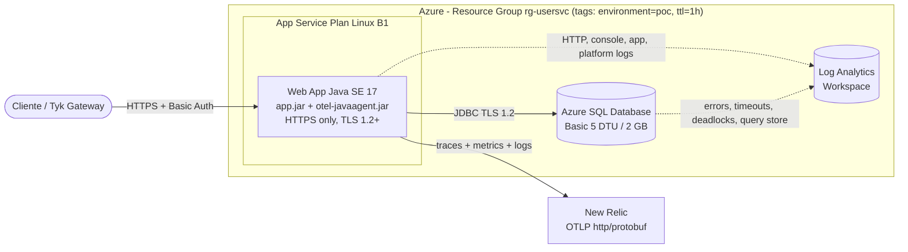

# PoC microservice-users - Azure App Service + Azure SQL + New Relic

API REST de usuarios (Spring Boot 3.2.5, Java 17) desplegada en **Azure App Service Linux**
con **Azure SQL Database**, instrumentada con el **agente OpenTelemetry Java (zero-code)**
hacia **New Relic**, y con **Azure Monitor** recogiendo los logs y métricas de plataforma.

No hay una sola línea de instrumentación en el código de negocio: el agente se adjunta al
arrancar y de ahí salen trazas, métricas y logs correlacionados.

Todo el despliegue es automático desde GitHub Actions con autenticación **OIDC federada** (sin
client secrets) y está dimensionado para el mínimo coste posible en un PoC de vida corta.

| Si quieres... | Ve a |
|---------------|------|
| Llamar a la API | [3. Cómo usar la API](#3-cómo-usar-la-api) |
| Ver trazas, métricas y logs en New Relic | [4. Cómo ver la telemetría en New Relic](#4-cómo-ver-la-telemetría-en-new-relic) |
| Ver lo que pasa en la base de datos | [5. Telemetría de base de datos](#5-telemetría-de-base-de-datos) |
| Consultar los logs de plataforma de Azure | [6. Azure Monitor y Log Analytics](#6-azure-monitor-y-log-analytics) |
| Arreglar que no llegan datos | [7. Si no llega telemetría](#7-si-no-llega-telemetría) |
| Desplegarlo desde cero | [8. Configuración previa](#8-configuración-previa) y [9. Despliegue](#9-despliegue) |
| Borrarlo para no pagar | [13. Limpieza de recursos](#13-limpieza-de-recursos) |

---

## 1. Arquitectura



### Recursos creados

| Recurso | Nombre | SKU / configuración |
|---------|--------|---------------------|
| Resource Group | `rg-usersvc` | tags `environment=poc`, `ttl=1h`, `owner`, `project`, `createdAt` |
| Log Analytics Workspace | `log-usersvc` | PerGB2018, retención 30 días, cuota diaria 1 GB |
| App Service Plan | `plan-usersvc` | Linux **B1** (configurable a F1 o B2) |
| Web App | `app-usersvc-<hash>` | Java SE 17, `httpsOnly`, TLS 1.2, FTPS deshabilitado, Always On, health check en `/actuator/health`, identidad administrada de sistema |
| SQL Server | `sql-usersvc-<hash>` | TLS mínimo 1.2, regla de firewall solo para servicios de Azure |
| SQL Database | `sqldb-users` | **Basic** 5 DTU, 2 GB, backup local |
| Diagnostic Settings | `diag-usersvc-app`, `diag-sqldb-users` | `allLogs` + métricas hacia Log Analytics |

---

## 2. Estructura del proyecto

```
src/main/java/com/example/microserviceusersapplication/
├── config/         SecurityConfig, HttpClientConfig, OutboundHttpLoggingInterceptor
├── controllers/    UsersController, SystemController, HttpBinController
├── dtos/           envolturas de respuesta (DataEnvelope, ErrorEnvelope...)
├── exceptions/     GlobalExceptionHandler y excepciones de dominio
├── filters/        RequestLoggingFilter (log de entrada/salida, X-Trace-Id y Baggage)
├── logging/        LevelMdcTurboFilter (expone el nivel como atributo en New Relic)
├── models/         entidad User y requests de entrada
├── observability/  Observability (anota span y MDC a la vez, y propaga Baggage)
├── repository/     UserRepository (Spring Data JPA)
└── services/       UserService, SystemService, HttpBinService

infra/
├── main.bicep              infraestructura del PoC (scope: suscripción)
├── main.bicepparam         parámetros leídos de variables de entorno
├── newrelic.bicep          integración nativa de New Relic (una vez por suscripción)
└── modules/                appservice, sql, monitoring, newrelic-monitor

.github/workflows/
├── deploy.yml                      build + infra + despliegue + smoke tests
├── newrelic-native-integration.yml integración nativa de Azure con New Relic
└── newrelic-azure-integration.yml  integración por polling (alternativa)
```

---

## 3. Cómo usar la API

### 3.1 Obtener la URL

```bash
APP=$(az webapp list -g rg-usersvc --query "[0].name" -o tsv)
URL="https://$(az webapp show -g rg-usersvc -n "$APP" --query defaultHostName -o tsv)"
echo "$URL"
```

Las credenciales son las de los secrets `BASIC_AUTH_USER` y `BASIC_AUTH_PASSWORD`:

```bash
export BASIC_AUTH_USER=...  BASIC_AUTH_PASSWORD=...
AUTH="-u $BASIC_AUTH_USER:$BASIC_AUTH_PASSWORD"
```

### 3.2 Endpoints

| Método | Ruta | Autenticación | Respuesta correcta |
|--------|------|---------------|--------------------|
| `GET` | `/actuator/health` | pública | `200` con el estado de la app y de la base de datos |
| `GET` | `/actuator/info` | pública | `200` con la información de la build |
| `GET` | `/actuator/metrics` | pública | `200` con la lista de métricas de Micrometer |
| `GET` | `/actuator/prometheus` | pública | `200` con las métricas en formato Prometheus |
| `GET` | `/status` | Basic Auth | `200` si la base de datos responde, `503` si no |
| `GET` | `/get` | Basic Auth | `200` con la respuesta de `httpbin.org/get`. Endpoint de demostración de instrumentación de salida, ver [4.7](#47-instrumentación-de-una-llamada-http-saliente-el-endpoint-get) |
| `GET` | `/users` | Basic Auth | `200` con la lista de usuarios |
| `GET` | `/users/{id}` | Basic Auth | `200` con el usuario, `404` si no existe |
| `POST` | `/users` | Basic Auth | `201` con el id creado, `409` si el email ya existe |
| `PATCH` | `/users/{id}` | Basic Auth | `204` sin cuerpo |
| `DELETE` | `/users/{id}` | Basic Auth | `204` sin cuerpo |

El esquema de base de datos lo crea Hibernate al arrancar (`ddl-auto: update`), no hay paso de
migración: la tabla `users` aparece sola en el primer arranque.

### 3.3 Ejemplos

```bash
# Salud, sin credenciales
curl -s "$URL/actuator/health" | jq

# Estado de las dependencias (hace un SELECT 1 real contra Azure SQL)
curl -s $AUTH "$URL/status" | jq
# {"data":[{"service":"database","status":"ok"}]}

# Alta de usuario
curl -s -X POST $AUTH "$URL/users" \
  -H "Content-Type: application/json" \
  -d '{"name":"Ada Lovelace","email":"ada@example.com"}' | jq
# {"data":{"id":"3f7c1b8e-..."}}

ID=$(curl -s -X POST $AUTH "$URL/users" -H "Content-Type: application/json" \
  -d '{"name":"Alan Turing","email":"alan@example.com"}' | jq -r .data.id)

# Listado y consulta por id
curl -s $AUTH "$URL/users" | jq
curl -s $AUTH "$URL/users/$ID" | jq
# {"data":{"id":"...","name":"Alan Turing","email":"alan@example.com",
#          "createdAt":"2026-01-01T10:00:00Z","updatedAt":null}}

# Modificación parcial: los campos ausentes no se tocan
curl -s -o /dev/null -w "%{http_code}\n" -X PATCH $AUTH "$URL/users/$ID" \
  -H "Content-Type: application/json" -d '{"name":"Alan M. Turing"}'
# 204

# Baja
curl -s -o /dev/null -w "%{http_code}\n" -X DELETE $AUTH "$URL/users/$ID"
# 204
```

Cuerpos y validaciones:

| Campo | `POST /users` | `PATCH /users/{id}` |
|-------|---------------|---------------------|
| `name` | obligatorio, no vacío | opcional |
| `email` | obligatorio, formato de email | opcional, formato de email |

### 3.4 Formato de las respuestas

Todo lo correcto viaja envuelto en `data`, y todo lo que falla en `error`:

```json
{ "data": { "id": "3f7c1b8e-..." } }
```

```json
{ "error": { "code": "NOT_FOUND", "message": "User 3f7c1b8e-... not found" } }
```

| Código HTTP | `error.code` | Cuándo |
|-------------|--------------|--------|
| `400` | `BAD_REQUEST` | Falla la validación del cuerpo |
| `401` | — | Falta o no vale el Basic Auth |
| `404` | `NOT_FOUND` | El usuario o la ruta no existen |
| `405` | `METHOD_NOT_ALLOWED` | Método no soportado en esa ruta |
| `409` | `CONFLICT` | El email ya está registrado |
| `415` | `UNSUPPORTED_MEDIA_TYPE` | Falta `Content-Type: application/json` |
| `500` | `INTERNAL_ERROR` | Error inesperado; el detalle real solo va al log |

### 3.5 La cabecera `X-Trace-Id`

Cada respuesta lleva la cabecera `X-Trace-Id` con el id de traza de esa petición concreta.
Es el atajo para pasar de una llamada a su traza en New Relic:

```bash
curl -si $AUTH "$URL/users" | grep -i x-trace-id
# X-Trace-Id: 4bf92f3577b34da6a3ce929d0e0e4736
```

Con ese valor, en New Relic: **Query builder** y

```sql
SELECT * FROM Span WHERE trace.id = '4bf92f3577b34da6a3ce929d0e0e4736'
```

o directamente `one.newrelic.com > APM & Services > microservice-users > Distributed tracing`
y pegar el id en el buscador.

### 3.6 Ejecución local

```bash
cp .env.example .env      # y rellena los CHANGE_ME
set -a && . ./.env && set +a
mvn spring-boot:run
curl -u "$BASIC_AUTH_USER:$BASIC_AUTH_PASSWORD" http://localhost:8080/users
```

En PowerShell:

```powershell
Get-Content .env | Where-Object { $_ -notmatch '^#' -and $_ -match '=' } |
  ForEach-Object { $k,$v = $_ -split '=',2
    [System.Environment]::SetEnvironmentVariable($k, $v) }
mvn spring-boot:run
```

Para instrumentar también en local y ver la telemetría en New Relic desde tu máquina:
`mvn package` (descarga el agente a `target/otel-javaagent.jar`) y descomenta
`JAVA_TOOL_OPTIONS` en `.env`.

La base de datos local sigue siendo la Azure SQL del PoC: hay que rellenar `SQL_SERVER`,
`SQL_SERVER_NAME` y las credenciales, y tu IP tiene que estar en el firewall del servidor
(la regla que crea el Bicep solo permite servicios de Azure).

```bash
MY_IP=$(curl -s ifconfig.me)
az sql server firewall-rule create -g rg-usersvc -s <servidor> \
  -n dev-laptop --start-ip-address "$MY_IP" --end-ip-address "$MY_IP"
```

---

## 4. Cómo ver la telemetría en New Relic

### 4.1 Qué se envía

| Señal | Contenido |
|-------|-----------|
| **Trazas** | Cada petición HTTP, con los spans hijos de JDBC (consultas a Azure SQL), incluyendo el tiempo de base de datos y la sentencia saneada |
| **Métricas** | JVM (heap, GC, hilos), HTTP server, pool de conexiones HikariCP y todas las métricas de Micrometer que expone Actuator |
| **Logs** | Todo lo que pasa por Logback, correlacionado con `trace_id` y `span_id` vía MDC, incluidos los logs internos del propio agente |

Además, `RequestLoggingFilter` añade a cada log de petición atributos estructurados que se
pueden filtrar y agrupar directamente en New Relic: `http.method`, `http.target`,
`http.status_code`, `http.duration_ms`, `http.client_ip`. Las cabeceras sensibles
(`authorization`, `cookie`, `x-api-key`...) se excluyen antes de enviarse.

### 4.2 Generar tráfico

La telemetría tarda **1-2 minutos** en aparecer. Genera algo de carga primero:

```bash
for i in $(seq 1 30); do
  curl -s -o /dev/null $AUTH "$URL/users"
  curl -s -o /dev/null $AUTH "$URL/status"
done

# Y algo de error, para que haya algo que investigar
curl -s -o /dev/null "$URL/users"                        # 401
curl -s -o /dev/null $AUTH "$URL/users/no-existe"        # 404
```

### 4.3 Dónde mirar en la interfaz

Todo está en `one.newrelic.com`. El servicio aparece como **`microservice-users`** dentro
del namespace `poc-observability`.

| Qué quieres ver | Ruta en la interfaz |
|-----------------|---------------------|
| Throughput, latencia y tasa de error | **APM & Services** > `microservice-users` > *Summary* |
| Trazas completas, con el desglose de tiempo en base de datos | **APM & Services** > `microservice-users` > *Distributed tracing* |
| Tiempo por operación de base de datos | **APM & Services** > `microservice-users` > *Databases* |
| Métricas de JVM (heap, GC, hilos) | **APM & Services** > `microservice-users` > *JVMs*, o *Metrics explorer* |
| Cualquier métrica suelta, incluidas las de HikariCP | **Query your data** > *Metrics explorer* > filtra por `jvm.`, `hikaricp.`, `http.server.` |
| Logs, ya correlacionados con las trazas | **Logs** > filtro `service.name:"microservice-users"` |
| Todo el PoC junto (gateway + microservicios) | **APM & Services**, filtrando por `service.namespace = poc-observability` |
| Consultas a medida | **Query your data** > *Query builder* (NRQL) |

Dos atajos que se usan mucho:

- En cualquier log, el enlace **See trace** salta a la traza de esa misma petición. Funciona
  porque el agente inyecta `trace.id` y `span.id` en cada registro.
- En cualquier span, la pestaña **Logs** muestra solo los logs de esa traza.

### 4.4 Recetario NRQL

Copia y pega en **Query your data > Query builder**.

**Salud del servicio**

```sql
-- Peticiones por minuto
SELECT rate(count(*), 1 minute) FROM Span
WHERE service.name = 'microservice-users' AND span.kind = 'server'
SINCE 30 minutes ago TIMESERIES

-- Latencia p50 / p95 / p99 por endpoint
SELECT percentile(duration.ms, 50, 95, 99) FROM Span
WHERE service.name = 'microservice-users' AND span.kind = 'server'
SINCE 30 minutes ago FACET name

-- Tasa de error
SELECT percentage(count(*), WHERE otel.status_code = 'ERROR') FROM Span
WHERE service.name = 'microservice-users' SINCE 30 minutes ago TIMESERIES

-- Reparto de códigos HTTP
SELECT count(*) FROM Span
WHERE service.name = 'microservice-users' AND http.response.status_code IS NOT NULL
SINCE 30 minutes ago FACET http.response.status_code
```

**Métricas**

```sql
-- Memoria de la JVM por pool
SELECT latest(jvm.memory.used) FROM Metric
WHERE service.name = 'microservice-users' SINCE 30 minutes ago
FACET jvm.memory.pool.name TIMESERIES

-- Pool de conexiones: activas, en espera y tamaño
SELECT latest(hikaricp.connections.active), latest(hikaricp.connections.pending),
       latest(hikaricp.connections) FROM Metric
WHERE service.name = 'microservice-users' SINCE 30 minutes ago TIMESERIES

-- Qué métricas están llegando (útil para descubrir nombres)
SELECT uniques(metricName) FROM Metric
WHERE service.name = 'microservice-users' SINCE 30 minutes ago LIMIT 200
```

**Logs**

```sql
-- Últimos logs con su traza
SELECT timestamp, message, trace.id, span.id FROM Log
WHERE service.name = 'microservice-users' SINCE 30 minutes ago LIMIT 50

-- Peticiones lentas, usando los atributos del filtro
SELECT timestamp, http.method, http.target, http.status_code, http.duration_ms, trace.id
FROM Log WHERE service.name = 'microservice-users' AND http.duration_ms > 500
SINCE 30 minutes ago LIMIT 50

-- Solo errores. El atributo "level" existe porque LevelMdcTurboFilter lo mete
-- en el MDC y el agente exporta el MDC como atributos del log
SELECT timestamp, message, trace.id FROM Log
WHERE service.name = 'microservice-users' AND level = 'ERROR'
SINCE 30 minutes ago LIMIT 50

-- Reparto por nivel: DEBUG, INFO, WARN, ERROR
SELECT count(*) FROM Log
WHERE service.name = 'microservice-users' SINCE 30 minutes ago FACET level TIMESERIES

-- Respuestas 5xx agrupadas por endpoint
SELECT count(*) FROM Log
WHERE service.name = 'microservice-users' AND http.status_code >= 500
SINCE 1 hour ago FACET http.target
```

**Base de datos** (más consultas en la sección 5)

```sql
-- Spans de base de datos: confirma que la instrumentación JDBC funciona
SELECT count(*), average(duration.ms) FROM Span
WHERE service.name = 'microservice-users' AND db.system IS NOT NULL
SINCE 30 minutes ago FACET name
```

**Vista de todo el PoC**

```sql
SELECT count(*) FROM Span
WHERE service.namespace = 'poc-observability' SINCE 1 hour ago FACET service.name
```

### 4.5 Variables del agente

Se aplican como app settings de la Web App. Estas son las que documenta New Relic para su
endpoint OTLP:

| Variable | Valor | Para qué |
|----------|-------|----------|
| `OTEL_EXPORTER_OTLP_ENDPOINT` | `https://otlp.eu01.nr-data.net:4318` | Endpoint OTLP de la cuenta |
| `OTEL_EXPORTER_OTLP_HEADERS` | `api-key=<license key>` | Autenticación de ingesta |
| `OTEL_EXPORTER_OTLP_PROTOCOL` | `http/protobuf` | Único protocolo OTLP admitido por New Relic |
| `OTEL_EXPORTER_OTLP_COMPRESSION` | `gzip` | Reduce el volumen de red |
| `OTEL_EXPORTER_OTLP_METRICS_TEMPORALITY_PREFERENCE` | `delta` | New Relic ingesta temporalidad delta |
| `OTEL_EXPORTER_OTLP_METRICS_DEFAULT_HISTOGRAM_AGGREGATION` | `base2_exponential_bucket_histogram` | Percentiles precisos con menos datos |
| `OTEL_METRIC_EXPORT_INTERVAL` | `30000` | Envío de métricas cada 30 s |
| `OTEL_TRACES_SAMPLER` | `parentbased_always_on` | Sin muestreo: todas las trazas |
| `OTEL_ATTRIBUTE_VALUE_LENGTH_LIMIT` | `4095` | New Relic descarta atributos más largos |
| `OTEL_EXPERIMENTAL_RESOURCE_DISABLED_KEYS` | `process.command_args` | Ese atributo supera el límite y no aporta valor |
| `OTEL_EXPERIMENTAL_EXPORTER_OTLP_RETRY_ENABLED` | `true` | Reintentos ante errores transitorios |
| `OTEL_SEMCONV_STABILITY_OPT_IN` | `http` | Convenciones semánticas HTTP estables |
| `OTEL_INSTRUMENTATION_LOGBACK_APPENDER_EXPERIMENTAL_CAPTURE_MDC_ATTRIBUTES` | `*` | Envía `trace_id` y `span_id` como atributos del log |
| `OTEL_INSTRUMENTATION_LOGBACK_APPENDER_EXPERIMENTAL_CAPTURE_KEY_VALUE_PAIR_ATTRIBUTES` | `true` | Convierte los `addKeyValue()` de SLF4J en atributos |
| `OTEL_JAVAAGENT_LOGGING` | `application` | Los logs del agente también llegan a New Relic |
| `OTEL_RESOURCE_ATTRIBUTES` | `service.name`, `service.version`, `service.namespace`, `deployment.environment`, `cloud.provider` | Permite filtrar y agrupar en New Relic |

Con `observability_enabled=false` en el despliegue, el agente sigue adjunto pero se
autodesactiva (`OTEL_JAVAAGENT_ENABLED=false`) y los tres exporters pasan a `none`.

### 4.6 Toda respuesta lleva `http.status_code`, incluidos los 401

Esto era un bug y merece explicación, porque es la clase de error que se repite.

`RequestLoggingFilter` estaba anotado con `@Order(1)`. La cadena de filtros de Spring Security se
registra con orden **`-100`**, que es más prioritario. Consecuencia: Security se ejecutaba
**antes**, respondía `401` y **nunca invocaba** el filtro de logging. Las peticiones rechazadas
no dejaban ni línea de log ni atributo `http.status_code`, así que en New Relic un ataque de
fuerza bruta contra la API era literalmente invisible.

Ahora el filtro va con `@Order(Ordered.HIGHEST_PRECEDENCE)`, envolviendo toda la cadena. Con eso,
**toda** respuesta queda registrada con su código, venga de un controlador o de Security.

```bash
# Un 401 sin credenciales y un 404 con ellas
curl -s -o /dev/null "$URL/users"
curl -s -o /dev/null $AUTH "$URL/users/00000000-0000-0000-0000-000000000000"
```

```sql
-- Antes esta consulta no devolvia ni un 401. Ahora si
SELECT count(*) FROM Log
WHERE service.name = 'microservice-users' AND http.status_code IS NOT NULL
SINCE 30 minutes ago FACET http.status_code

-- Intentos de autenticacion fallidos, por IP de origen
SELECT count(*) FROM Log
WHERE service.name = 'microservice-users' AND http.status_code = 401
SINCE 1 hour ago FACET http.client_ip
```

El mismo fallo estaba en `microservice-orders` y también está corregido allí.

### 4.7 Instrumentación de una llamada HTTP saliente: el endpoint `/get`

`GET /get` hace una llamada HTTP a `httpbin.org/get` y devuelve su respuesta tal cual. Existe
solo para ver cómo se instrumenta una dependencia de salida, y `httpbin` es útil porque
**devuelve en el cuerpo las cabeceras que ha recibido**: es la forma directa de comprobar qué se
envía realmente.

```bash
curl -s $AUTH "$URL/get" | jq
```

En la respuesta verás dos cosas que nadie ha programado:

```json
{ "data": { "headers": {
    "Traceparent": "00-4bf92f3577b34da6a3ce929d0e0e4736-00f067aa0ba902b7-01",
    "X-Poc-Source": "microservice-users",
    "User-Agent": "Java/17"
} } }
```

La cabecera **`Traceparent`** la inyecta el agente OpenTelemetry en la petición saliente sin una
línea de código. Es el mecanismo exacto por el que las trazas cruzan de un servicio a otro.

En la traza aparecen **dos spans**: el de servidor de `/get` y, colgando de él, el de cliente de
la llamada a httpbin, con su propia duración. Ahí se ve cuánto del tiempo total se fue esperando
a un tercero.

#### Cómo identificar las llamadas salientes

| Atributo | Valor | Quién lo pone |
|----------|-------|---------------|
| `span.kind` | `client` | El agente |
| `peer.service` | `httpbin` | `OutboundHttpLoggingInterceptor` |
| `http.client.dependency` | `httpbin` | El interceptor, en el span y en el log |
| `url.full`, `server.address` | La url y el host | El agente y el interceptor |
| `http.request.header.traceparent` | El contexto propagado | El agente, vía `OTEL_INSTRUMENTATION_HTTP_CLIENT_CAPTURE_REQUEST_HEADERS` |

```sql
-- Todas las llamadas salientes del servicio, por dependencia
SELECT count(*), average(duration.ms), percentile(duration.ms, 95) FROM Span
WHERE service.name = 'microservice-users' AND span.kind = 'client'
SINCE 30 minutes ago FACET peer.service, name

-- Solo las llamadas a httpbin, con lo que se envio y lo que volvio
SELECT timestamp, url.full, http.status_code, http.client.duration_ms,
       http.request.headers, http.response.body FROM Log
WHERE service.name = 'microservice-users' AND http.client.dependency = 'httpbin'
SINCE 30 minutes ago LIMIT 50

-- Cabeceras capturadas en el span de cliente
SELECT url.full, http.request.header.traceparent, http.request.header.x_poc_source FROM Span
WHERE service.name = 'microservice-users' AND span.kind = 'client'
SINCE 30 minutes ago LIMIT 20
```

#### Cabeceras sí, cuerpos no: quién captura qué

Esta distinción importa y no es evidente:

| Dato | Lo captura | Cómo |
|------|-----------|------|
| Método, url, host, código de respuesta, duración | **El agente**, sin configuración | Convenciones HTTP de OTel |
| Cabeceras seleccionadas | **El agente**, si se lo pides | `OTEL_INSTRUMENTATION_HTTP_{CLIENT,SERVER}_CAPTURE_{REQUEST,RESPONSE}_HEADERS`, con la lista de nombres |
| **Cuerpo de la petición y de la respuesta** | **La aplicación** | `OutboundHttpLoggingInterceptor`. **El agente no captura cuerpos y no hay ninguna variable que lo active**: no forma parte de las convenciones HTTP de OTel |

Las listas de cabeceras están en [appservice.bicep](infra/modules/appservice.bicep) y en
[`.env.example`](.env.example). **`authorization` no figura en ninguna de las dos, de forma deliberada.**
`traceparent` sí, justo para poder ver la propagación.

Dos detalles de implementación que conviene conocer si tocas esto:

- El interceptor necesita **`BufferingClientHttpRequestFactory`**
  ([HttpClientConfig.java](src/main/java/com/example/microserviceusersapplication/config/HttpClientConfig.java)).
  Sin ella, leer el cuerpo de la respuesta para registrarlo consume el stream y el controlador
  recibe un cuerpo vacío.
- Los cuerpos se recortan a 2000 caracteres. New Relic descarta atributos de más de 4095, así que
  un payload grande sin recortar se perdería entero en silencio.

> **Aviso de datos personales.** El cuerpo de una petición puede contener PII. Contra
> `httpbin.org` es inocuo, pero si reutilizas este interceptor contra un servicio real, filtra
> los campos o desactiva el registro del cuerpo.

---

## 5. Telemetría de base de datos

Es la parte que más confusión genera, porque hay **cinco cosas distintas** que se suelen llamar
igual y llegan por caminos separados.

| Qué | Quién lo emite | Dónde se ve | Requiere |
|-----|----------------|-------------|----------|
| **Spans de SQL**: una consulta, su duración y su sentencia | Agente OTel, instrumentando JDBC | New Relic, `Span` | Nada, va por defecto |
| **Métricas del pool** de conexiones | Micrometer vía Actuator | New Relic, `Metric` | Nada, va por defecto |
| **Logs de SQL**: la sentencia como registro de log | La aplicación, logger `org.hibernate.SQL` | New Relic, `Log` | `SQL_LOG_LEVEL=DEBUG` |
| **Logs de plataforma**: errores, timeouts, bloqueos, deadlocks, Query Store | Azure Monitor | Log Analytics y/o New Relic | Diagnostic Setting, y **que ocurra el evento** |
| **Auditoría**: una entrada por sentencia ejecutada | El motor SQL | Log Analytics y/o New Relic, `SQLSecurityAuditEvents` | `ENABLE_SQL_AUDIT=true` |

La distinción que más cuesta al empezar es **quién emite el log**. Las tres primeras filas las
emite tu aplicación: es tu proceso Java contando lo que hace. Las dos últimas las emite Azure.
Una base de datos PaaS no tiene sistema de ficheros al que asomarse ni un agente que instalar
dentro: lo único que puede publicar es lo que Azure Monitor le deja publicar.

### 5.1 Spans de SQL (activo por defecto)

Es la vía principal para ver qué hace la aplicación contra la base de datos. Cada sentencia
cuelga del span de la petición HTTP que la provocó.

```sql
-- ¿Llegan spans de base de datos?
SELECT count(*) FROM Span
WHERE service.name = 'microservice-users' AND db.system IS NOT NULL
SINCE 30 minutes ago TIMESERIES

-- Tiempo de base de datos por sentencia
SELECT count(*), average(duration.ms), max(duration.ms) FROM Span
WHERE service.name = 'microservice-users' AND db.system IS NOT NULL
SINCE 30 minutes ago FACET db.statement

-- Esperas del pool de conexiones (spans de DataSource.getConnection)
SELECT average(duration.ms), max(duration.ms) FROM Span
WHERE service.name = 'microservice-users' AND name LIKE '%getConnection%'
SINCE 30 minutes ago TIMESERIES

-- Consultas que fallan
SELECT timestamp, db.statement, otel.status_description, trace.id FROM Span
WHERE service.name = 'microservice-users' AND db.system IS NOT NULL
  AND otel.status_code = 'ERROR' SINCE 1 hour ago LIMIT 50
```

Lo activan estas variables, ya aplicadas por el Bicep:

| Variable | Efecto |
|----------|--------|
| `OTEL_INSTRUMENTATION_COMMON_DB_STATEMENT_SANITIZER_ENABLED=true` | Manda la sentencia con los valores literales sustituidos por `?` |
| `OTEL_INSTRUMENTATION_JDBC_DATASOURCE_ENABLED=true` | Añade un span por `DataSource.getConnection`, que hace visibles las esperas del pool. Desactivado por defecto en el agente |
| `OTEL_INSTRUMENTATION_MICROMETER_ENABLED=true` | Publica las métricas de HikariCP y del resto de Actuator como métricas OTLP |

### 5.2 Logs de SQL (hay que activarlos)

**Por defecto no llega ni una sentencia SQL a los logs de New Relic, y es intencionado.**
Para activarlas, pon la variable de repositorio `SQL_LOG_LEVEL=DEBUG` en
`Settings > Secrets and variables > Actions > Variables` y vuelve a desplegar.

```sql
SELECT timestamp, message, trace.id FROM Log
WHERE service.name = 'microservice-users' AND message LIKE '%select%'
SINCE 30 minutes ago LIMIT 50
```

Con `SQL_BIND_LOG_LEVEL=TRACE` se añaden además los valores de los parámetros, que son los
datos reales enviados a la base de datos. Úsalo solo para depurar y quítalo después.

Devuélvelo a `INFO` en cuanto termines: sube bastante el volumen de logs y con la cuota diaria
de 1 GB del workspace es fácil llegar al tope.

> **Detalle que importa si tocas esto.** El nivel se declara en `application.yaml` bajo
> `logging.level` como `org.hibernate.SQL: ${SQL_LOG_LEVEL:INFO}`, y **no** como un app setting
> `LOGGING_LEVEL_ORG_HIBERNATE_SQL`. El relaxed binding de Spring Boot pasa a minúsculas los
> nombres de las variables de entorno, y `org.hibernate.sql` es un logger distinto de
> `org.hibernate.SQL`: por esa vía el nivel se aplica a un logger que nadie usa y no aparece
> ninguna sentencia.
>
> Por el mismo motivo `spring.jpa.show-sql` está en `false`: escribe directamente en
> `System.out`, que el agente no instrumenta, así que esas líneas se quedan en la consola del
> contenedor y nunca llegan a New Relic.

### 5.3 Logs de plataforma del servicio SQL

Los genera Azure, no la aplicación. Cubren `Errors`, `Timeouts`, `Blocks`, `Deadlocks`,
`QueryStoreRuntimeStatistics`, `QueryStoreWaitStatistics`, `DatabaseWaitStatistics`,
`SQLInsights` y `AutomaticTuning`, y van al workspace por el Diagnostic Setting
`diag-sqldb-users`.

**Una consulta que funciona no genera ninguno de esos logs.** Son categorías de eventos
excepcionales: si no hay errores, ni timeouts, ni bloqueos, no hay nada que registrar y la
tabla `AzureDiagnostics` sale vacía por más peticiones que hagas. Lo único que llega con
tráfico normal es:

- **`QueryStoreRuntimeStatistics`**, que se emite por ventana de agregación del Query Store.
  En Azure SQL esa ventana es de **60 minutos** por defecto, así que en un PoC corto puede no
  llegar nada.
- Las **métricas** (`AzureMetrics`): DTU consumidas, conexiones, almacenamiento. Estas sí
  fluyen en minutos.

Las **16 categorías** de log que publica `Microsoft.Sql/servers/databases` entran todas, porque
`categoryGroup: 'allLogs'` las incluye por definición: `Errors`, `Timeouts`, `Blocks`,
`Deadlocks`, `Waits`, `DatabaseWaitStatistics`, `QueryStoreRuntimeStatistics`,
`QueryStoreWaitStatistics`, `SQLInsights`, `AutomaticTuning`, `DevOpsOperationsAudit`,
`SQLSecurityAuditEvents`, `SqlRequests`, `ExecRequests`, `RequestSteps` y `DmsWorkers`. No hay
ninguna que se quede fuera.

En métricas se recogen **dos** de las tres categorías:

| Categoría | Qué trae | Estado |
|-----------|----------|--------|
| `Basic` | DTU, almacenamiento, sesiones, workers, deadlocks, `availability` y los contadores de conexión (`connection_successful`, `connection_failed`, `blocked_by_firewall`) | Activa |
| `InstanceAndAppAdvanced` | CPU y memoria del motor (`sql_instance_cpu_percent`, `sql_instance_memory_percent`) y uso de tempdb | Activa |
| `WorkloadManagement` | Métricas `wlg_*` de grupos de carga | **Excluida**: solo aplica a data warehouses, no a una base de datos única |

### 5.3.1 No existe un log de arranque de Azure SQL Database

Esto es importante y conviene decirlo claro, porque se busca mucho y no está: **Azure SQL
Database no expone el error log ni el log de arranque del motor.** Es PaaS, no hay sistema de
ficheros al que asomarse, y `sp_readerrorlog` y `xp_readerrorlog` **no están soportados** (sí lo
están en Managed Instance, que es otro producto). Tampoco hay un "arranque" de una base de datos
única que se pueda leer: el servidor lógico es infraestructura gestionada y multitenant.

Lo que sí tienes, y cubre en la práctica lo que se busca en un log de arranque:

| Quieres saber | Dónde está |
|---------------|------------|
| Que la base de datos ha estado o no disponible | Métrica `availability` de la categoría `Basic`: por cada minuto vale 100 % si alguna conexión tuvo éxito y 0 % si todas fallaron |
| Que hubo un failover, un escalado o una restauración | **Activity Log**, categorías `Administrative` y `ResourceHealth`. Es el equivalente de plataforma a "el motor se reinició" |
| Errores del motor, que es lo que en on-premise iría al ERRORLOG | Categoría de log `Errors` |
| Quién se conectó y quién no pudo | Métricas `connection_successful`, `connection_failed`, `connection_failed_user_error`, `blocked_by_firewall`, y con auditoría los grupos `*_DATABASE_AUTHENTICATION_GROUP` |
| Que el esquema se creó al arrancar la aplicación | Auditoría: el `CREATE TABLE` de Hibernate es un batch más, y además queda como `SCHEMA_OBJECT_CHANGE_GROUP`. Ver [5.4](#54-auditoría-el-log-por-sentencia-del-propio-motor) |
| El arranque de la aplicación y su conexión a la base de datos | Eso **no** es un log de SQL: son logs de la aplicación, van por Logback al agente OTel y a New Relic, y también a `AppServiceConsoleLogs` |

```bash
# Disponibilidad minuto a minuto: lo mas parecido a "ha estado arriba"
az monitor log-analytics query --workspace "$WS" --analytics-query "
AzureMetrics
| where ResourceProvider == 'MICROSOFT.SQL' and MetricName == 'availability'
| project TimeGenerated, Average
| order by TimeGenerated desc | take 60"

# Eventos de plataforma: failover, escalado, cambios de estado
az monitor log-analytics query --workspace "$WS" --analytics-query "
AzureActivity
| where ResourceProvider == 'MICROSOFT.SQL'
| project TimeGenerated, Caller, OperationNameValue, ActivityStatusValue
| order by TimeGenerated desc | take 50"
```

Para ver el consumo de la base de datos con tráfico normal, mira las métricas, no los logs:

```bash
WS=$(az monitor log-analytics workspace show -g rg-usersvc -n log-usersvc --query customerId -o tsv)

az monitor log-analytics query --workspace "$WS" --analytics-query "
AzureMetrics
| where ResourceProvider == 'MICROSOFT.SQL'
| where MetricName in ('dtu_consumption_percent','connection_successful','storage_percent')
| project TimeGenerated, MetricName, Average, Maximum
| order by TimeGenerated desc | take 50"
```

Si quieres provocar un log de la categoría `Errors` para comprobar que el camino funciona,
tiene que ser un error **del motor**, no de la aplicación: un `404` de `/users/{id}` no sirve,
porque eso lo resuelve la aplicación sin llegar a fallar ninguna sentencia. Lo más rápido es
un login fallido:

```bash
sqlcmd -S <servidor>.database.windows.net -d sqldb-users -U usuario_que_no_existe -P loquesea
```

Un minuto después debería aparecer con `Category == 'Errors'`:

```bash
az monitor log-analytics query --workspace "$WS" --analytics-query "
AzureDiagnostics
| where ResourceProvider == 'MICROSOFT.SQL' and Category == 'Errors'
| project TimeGenerated, Message
| order by TimeGenerated desc | take 20"
```

### 5.4 Auditoría: el log por sentencia del propio motor

Si lo que buscas es "la base de datos registrando cada consulta que recibe", eso existe y se
llama **Azure SQL Auditing**. Es lo más parecido a un logger propio que tiene el servicio, y
va a la categoría `SQLSecurityAuditEvents`, tabla del mismo nombre en Log Analytics.

Con el grupo de acciones `BATCH_COMPLETED_GROUP` escribe un registro por batch ejecutado, con
la sentencia, el principal que la lanzó, la IP del cliente, la duración y las filas afectadas.
Ahí es donde aparece el `CREATE TABLE` que Hibernate ejecuta al arrancar con `ddl-auto: update`,
así que es la vía para ver el esquema creándose desde el punto de vista del motor.

Los grupos activados, y por qué cada uno:

| Grupo | Qué registra | Volumen |
|-------|--------------|---------|
| `BATCH_COMPLETED_GROUP` | Cada batch de sentencias ejecutado | Alto: es el que hace que esto sea verboso |
| `SUCCESSFUL_DATABASE_AUTHENTICATION_GROUP` | Conexiones que entraron | Medio |
| `FAILED_DATABASE_AUTHENTICATION_GROUP` | Intentos de conexión rechazados | Bajo, y es el que importa en seguridad |
| `SCHEMA_OBJECT_CHANGE_GROUP` / `DATABASE_OBJECT_CHANGE_GROUP` | `CREATE`, `ALTER` y `DROP` de objetos, como registro explícito | Bajo |
| `DATABASE_PRINCIPAL_CHANGE_GROUP` / `DATABASE_ROLE_MEMBER_CHANGE_GROUP` | Altas de usuarios y cambios de pertenencia a roles | Muy bajo |
| `DATABASE_PERMISSION_CHANGE_GROUP` / `DATABASE_OBJECT_PERMISSION_CHANGE_GROUP` | Quién concedió o revocó qué permiso | Muy bajo |

Todo el volumen viene de `BATCH_COMPLETED_GROUP`. Los demás son eventos raros y son justo los
que interesan en una auditoría, así que si necesitas bajar la ingesta, quita ese y deja el resto.

**Está desactivado por defecto.** La categoría viaja dentro del `allLogs` del Diagnostic
Setting desde siempre, pero sin la política de auditoría nunca se genera un solo registro: es
un canal abierto sin nadie hablando al otro lado. Para activarlo, pon la variable de
repositorio `ENABLE_SQL_AUDIT=true` y vuelve a desplegar.

```bash
# Comprobar en qué estado está
az sql db audit-policy show -g rg-usersvc -s <servidor> -n sqldb-users -o table

# Consultar la auditoría
az monitor log-analytics query --workspace "$WS" --analytics-query "
SQLSecurityAuditEvents
| project TimeGenerated, Statement, ServerPrincipalName, ClientIp, DurationMs, AffectedRows
| order by TimeGenerated desc | take 50"
```

No usa storage account ni ningún recurso extra: la plantilla lo declara con
`isAzureMonitorTargetEnabled`. Lo que sí cuesta es la ingesta, y es verbosa: con la cuota diaria
de 1 GB del workspace se llega al tope rápido. Enciéndela para la demo y apágala después.

#### El destino de la auditoría: un solo Diagnostic Setting, y no puede faltar

Aquí hay un detalle que cuesta un despliegue fallido si se toca mal, así que queda escrito.

La política de auditoría con `isAzureMonitorTargetEnabled` **no lleva los registros a ningún
sitio por sí sola**: los emite al canal de diagnóstico, y hace falta un Diagnostic Setting con la
categoría `SQLSecurityAuditEvents` que los recoja. La documentación de Microsoft lo dice así:

> *"When auditing is configured with Azure external monitors (for example, Event Hubs or Log
> Analytics) as the target, an additional diagnostic settings resource named
> `SQLSecurityAuditEvents_XXXX-XXXX-XXX` is created, which is critical for the proper functioning
> of auditing."*
>
> *"If the diagnostic settings are deleted, either intentionally or unintentionally, the auditing
> functionality will fail silently, and audit logs won't be sent to the target location."*

Eso es lo que hacen el portal y los cmdlets de PowerShell: crean un setting **dedicado**. Desde
Bicep **no hace falta crear uno aparte**, y de hecho **no se puede**: el `categoryGroup: 'allLogs'`
de `diag-<bd>` ya incluye la categoría `SQLSecurityAuditEvents`, y Azure rechaza un segundo
setting que apunte al mismo workspace para la misma categoría:

```
Conflict: Data sink '.../workspaces/log-usersvc' is already used in diagnostic setting
'diag-sqldb-users' for category 'SQLSecurityAuditEvents'. Data sinks can't be reused in
different settings on the same category for the same resource.
```

Ese error es, de paso, la prueba de que `allLogs` cubre la categoría de auditoría.

**Consecuencia práctica, y es la que importa:** el Diagnostic Setting genérico es *también* el
destino del rastro de auditoría. Si se apaga, la auditoría se queda muda sin dar ningún error. Por
eso su condición en [`infra/modules/sql.bicep`](infra/modules/sql.bicep) es
`if (enableLogAnalytics || enableSqlAudit)`: con la auditoría encendida el setting se crea
**aunque** pongas `ENABLE_LOG_ANALYTICS=false`, precisamente para que seguir el consejo de apagar
Log Analytics cuando el monitor nativo de New Relic ya reenvía los logos no rompa la auditoría en
silencio.

#### Si la auditoría está activa y no llega nada

Recorre esto en orden, que es el diagnóstico real:

```bash
# 1. La politica de auditoria esta activa y apunta a Azure Monitor?
az sql db audit-policy show -g rg-usersvc -s <servidor> -n sqldb-users   --query "{state:state, azureMonitor:isAzureMonitorTargetEnabled, grupos:auditActionsAndGroups}" -o json
# state debe ser Enabled y azureMonitor true

# 2. Existe el Diagnostic Setting que recoge la categoria?
DB_ID=$(az sql db show -g rg-usersvc -s <servidor> -n sqldb-users --query id -o tsv)
az monitor diagnostic-settings list --resource "$DB_ID"   --query "value[].{name:name, grupos:logs[?enabled].categoryGroup, categorias:logs[?enabled].category}" -o json

# 3. Hay registros en la tabla?
WS=$(az monitor log-analytics workspace show -g rg-usersvc -n log-usersvc --query customerId -o tsv)
az monitor log-analytics query --workspace "$WS" --analytics-query "
SQLSecurityAuditEvents | summarize count() by bin(TimeGenerated, 5m) | order by TimeGenerated desc"
```

Causas por orden de probabilidad si el paso 1 devuelve `Disabled`:

| Causa | Comprobación |
|-------|--------------|
| Existe una **variable de repositorio** `ENABLE_SQL_AUDIT` con valor `false`, que gana al valor por defecto del workflow | `Settings > Secrets and variables > Actions > Variables` |
| No se ha redesplegado desde que se activó | Revisar la fecha del último run de `deploy` |
| El despliegue falló en el paso *Deploy infrastructure* y no llegó a aplicar la política | Log del workflow |

Y si el paso 1 está bien pero el 3 sale vacío: recuerda que `BATCH_COMPLETED_GROUP` solo registra
sentencias **ejecutadas**. Genera tráfico contra la API antes de mirar.

> **Aviso operativo de la propia documentación:** si alguien borra el Diagnostic Setting, la
> auditoría deja de emitir sin ningún error. Microsoft recomienda crear una alerta sobre el
> borrado de diagnostic settings. En este PoC el redespliegue lo recrea, pero en un entorno real
> esa alerta es lo que evita descubrirlo cuando alguien pide una auditoría.

#### Y por qué pueden estar en Log Analytics pero no en New Relic

Son **dos condiciones independientes** y hay que separarlas antes de tocar nada:

| Condición | Qué la cumple | Cómo se comprueba |
|-----------|---------------|-------------------|
| **1. Que la auditoría genere registros** | La política de auditoría activa (`ENABLE_SQL_AUDIT`) | La tabla `SQLSecurityAuditEvents` del workspace tiene filas |
| **2. Que Azure los reenvíe a New Relic** | El **servicio nativo** de New Relic, que crea un Diagnostic Setting hacia New Relic sobre la base de datos | `az monitor diagnostic-settings list` muestra una entrada apuntando a New Relic |

Si la 1 se cumple y la 2 no, verás los logs en Log Analytics y **nunca** en New Relic, por muchas
consultas que hagas. La base de datos no tiene agente: sus logs solo pueden llegar a New Relic por
esa vía.

**El caso que más despista:** la integración **por polling** (`newrelic-azure-integration`) trae
**solo métricas, ningún log**. Con ella la entidad de la base de datos aparece en New Relic, con
sus pestañas de métricas, y la de *Logs* dice para siempre *"We can't find any logs from this
host"*. Es exactamente el síntoma de tener polling y no tener el servicio nativo.

```bash
# Existe el monitor nativo en la suscripcion? Si esto sale vacio,
# NINGUN log de Azure Monitor llega a New Relic.
az resource list --resource-type "NewRelic.Observability/monitors" -o table

# Y sobre la base de datos, hay un setting que apunte a New Relic?
DB_ID=$(az sql db show -g rg-usersvc -s <servidor> -n sqldb-users --query id -o tsv)
az monitor diagnostic-settings list --resource "$DB_ID"   --query "value[].{name:name, workspace:workspaceId, newRelic:marketplacePartnerId}" -o json
```

Si el monitor no existe, el motivo casi seguro es que faltan los secrets `NR_ACCOUNT_ID`,
`NR_ORGANIZATION_ID` y `NR_USER_EMAIL`: **el pipeline ya intenta crearlo en cada despliegue**, en
el job `Ensure the New Relic native integration`. Ese job es `continue-on-error`, así que sale en
rojo sin tumbar el despliegue de la aplicación. Mira su log: dirá exactamente qué secret falta.

Una vez creado, recuerda que el Diagnostic Setting sobre un recurso puede tardar **hasta una
hora** en aparecer.

Mientras tanto, los logs sí están en Log Analytics y se consultan con la KQL de arriba.

#### Azure dice "Sending" pero la pestaña *Logs* de la entidad está vacía

Es el caso que más confunde, y **no es un fallo**. En el portal, sobre el recurso monitor >
*Monitored Resources*, la columna *Logs to New Relic* en `Sending` significa que Azure está
entregando. Si aun así la pestaña **Logs** de la entidad de la base de datos en New Relic dice
*"We can't find any logs from this host"*, el motivo es dónde se busca:

Esa pestaña correlaciona por **entidad de host**, y los logs que llegan de Azure Monitor no son
logs de un host: son registros con atributos de Azure (`resourceId`, `category`, `operationName`).
New Relic no los asocia a la entidad de infraestructura, así que la pestaña sale vacía **aunque
los logs estén en la cuenta**.

Búscalos por su atributo real, en **Query your data**:

```sql
-- Todo lo que llega de Azure Monitor, por recurso y categoria
SELECT count(*) FROM Log
WHERE resourceId IS NOT NULL SINCE 3 hours ago FACET resourceId, category

-- Solo lo de SQL. El resourceId de Azure llega en MAYUSCULAS
SELECT timestamp, category, operationName, resourceId FROM Log
WHERE resourceId LIKE '%MICROSOFT.SQL%' SINCE 3 hours ago LIMIT 100
```

Si esas consultas devuelven filas, está todo funcionando y lo único que pasaba es que la pestaña
de la entidad no es el sitio. Si devuelven cero **y** Azure dice `Sending`, entonces no se está
generando ningún evento: repasa el bloque anterior, porque las categorías de Azure SQL son de
eventos excepcionales y una consulta correcta no produce ninguna.

Detalle que ayuda a interpretar la lista: junto a la base de datos aparece también **`master`**.
Es normal y es buena señal: ahí es donde el motor escribe los eventos de conexión al servidor
lógico.

#### "Metrics not configured" es otra cosa, y probablemente un permiso

En la misma pantalla, la columna *Metrics to New Relic* puede aparecer como **Metrics not
configured** aunque las `tagRules` que despliega la plantilla pidan `sendMetrics: Enabled`.

Las métricas y los logs no viajan igual. Los logs los entrega el resource provider por
Diagnostic Settings. Las métricas las **lee** la identidad administrada del monitor, y para eso
necesita el rol `Monitoring Reader` sobre la suscripción. Azure lo asigna por su cuenta, pero
crear una asignación de rol requiere permisos de RBAC, y la identidad federada del pipeline tiene
`Contributor`, que **no puede crear asignaciones de rol**.

```bash
# Que rol tiene la identidad del monitor
MON_PRINCIPAL=$(az resource show -g rg-newrelic-shared -n newrelic-poc-observability   --resource-type "NewRelic.Observability/monitors" --query identity.principalId -o tsv)
az role assignment list --assignee "$MON_PRINCIPAL" --all -o table

# Y que dicen las tag rules realmente desplegadas
az resource show -g rg-newrelic-shared --name "newrelic-poc-observability/default"   --resource-type "NewRelic.Observability/monitors/tagRules" --query properties -o json
```

Si la lista de roles sale vacía, asígnalo una vez a mano con una identidad que sí tenga permisos
de RBAC:

```bash
SUB_ID=$(az account show --query id -o tsv)
az role assignment create --assignee-object-id "$MON_PRINCIPAL"   --assignee-principal-type ServicePrincipal   --role "Monitoring Reader" --scope "/subscriptions/$SUB_ID"
```

No afecta a los logs, que es lo que estábamos persiguiendo: esos ya llegan sin este rol.

#### Los logs siguen vacíos en New Relic: el orden correcto de comprobación

"Sending" en el portal significa **el canal está sano**, no "hay datos". Separa las dos preguntas
en este orden, porque cada una se responde en un sitio distinto:

**1. ¿Se está generando algo?** Se responde en Log Analytics, no en New Relic.

```bash
WS=$(az monitor log-analytics workspace show -g rg-usersvc -n log-usersvc --query customerId -o tsv)

# Auditoria
az monitor log-analytics query --workspace "$WS" --analytics-query "
SQLSecurityAuditEvents | summarize count() by bin(TimeGenerated, 10m) | order by TimeGenerated desc | take 20"

# Resto de categorias de SQL
az monitor log-analytics query --workspace "$WS" --analytics-query "
AzureDiagnostics | where ResourceProvider == 'MICROSOFT.SQL'
| summarize count() by Category | order by count_ desc"
```

Si esto sale **vacío**, New Relic no puede tener nada: no existe el dato. Lo primero a descartar
es que la política de auditoría esté realmente aplicada, y para eso hace falta un despliegue
**verde**: si el módulo `sql` falló en el último run, la política no se creó.

```bash
az sql db audit-policy show -g rg-usersvc -s <servidor> -n sqldb-users   --query "{state:state, azureMonitor:isAzureMonitorTargetEnabled}" -o json
```

**2. Si el paso 1 tiene filas y New Relic no**, entonces el problema es el destino o la consulta.
No adivines el nombre de los atributos: pregúntaselo a New Relic.

```sql
-- Que atributos traen realmente los logs de esta cuenta
SELECT keyset() FROM Log SINCE 1 day ago

-- De donde viene cada log que llega
SELECT count(*) FROM Log SINCE 1 day ago FACET service.name, collector.name, instrumentation.provider
```

Con eso ves si existe `resourceId` o si viene con otro nombre, y si hay algún log de origen Azure.

**Y comprueba que es la misma cuenta.** Es la causa que más cuesta ver:

| Camino | A qué cuenta de New Relic entrega |
|--------|-----------------------------------|
| Telemetría OTLP de la aplicación | La cuenta asociada a `NR_LICENSE_KEY` |
| Logs de Azure Monitor | La cuenta cuyo id está en `NR_ACCOUNT_ID` |

Si esos dos no son la misma cuenta, verás los logs de la aplicación donde estás mirando y los de
la base de datos en otra, sin ningún error en ninguna parte. Compara el `NR_ACCOUNT_ID` del secret
con el id de cuenta que aparece en la esquina de la interfaz donde estás consultando.

#### Tabla dedicada o AzureDiagnostics: por qué una consulta correcta sale vacía

Síntoma real que costó encontrar: la auditoría genera miles de registros y la tabla
`SQLSecurityAuditEvents` está vacía.

```
AzureDiagnostics | where ResourceProvider == 'MICROSOFT.SQL'
| summarize count() by Category
-->  SQLSecurityAuditEvents  3676
     DatabaseWaitStatistics   261
     ...

SQLSecurityAuditEvents | summarize count() by bin(TimeGenerated, 10m)
-->  []
```

No es una contradicción: son dos **modos de recolección** del Diagnostic Setting.

| Modo | Dónde acaba el dato | Columnas |
|------|---------------------|----------|
| `AzureDiagnostics` (**por defecto**) | Todo en la tabla genérica `AzureDiagnostics`, con `Category` como discriminador | Dinámicas y con sufijo de tipo: `statement_s`, `client_ip_s`, `duration_milliseconds_d` |
| `Dedicated` | Una tabla por categoría: `SQLSecurityAuditEvents`, `AppServiceHTTPLogs`, `ContainerRegistryLoginEvents`... | Con su nombre real: `Statement`, `ClientIp`, `DurationMs` |

Los Diagnostic Settings de este PoC declaran ahora **`logAnalyticsDestinationType: 'Dedicated'`**,
que es lo que hace válidas las consultas de este README. Sin esa línea, la categoría aparece en
`AzureDiagnostics` y la tabla dedicada existe pero vacía.

**Al cambiarlo, el dato anterior no se mueve.** Lo ya ingestado se queda en `AzureDiagnostics` y
solo lo nuevo va a la tabla dedicada, así que justo después de redesplegar conviene consultar las
dos. Equivalencia para el dato antiguo:

```kusto
AzureDiagnostics
| where ResourceProvider == 'MICROSOFT.SQL' and Category == 'SQLSecurityAuditEvents'
| project TimeGenerated, statement_s, server_principal_name_s, client_ip_s, duration_milliseconds_d
| order by TimeGenerated desc | take 50
```

#### Auditoría o logs de la aplicación: cuál usar

Las dos ven las mismas consultas, pero no sirven para lo mismo.

| | Vista de la aplicación (`org.hibernate.SQL` y spans) | Vista del motor (auditoría) |
|---|---|---|
| Quién lo emite | El proceso Java | El motor SQL |
| Correlación con `trace.id` | Sí, automática | No, hay que cruzar por tiempo y sentencia |
| Alcance | Solo lo que hace **tu** aplicación | **Todo** lo que entra en la base de datos, venga de donde venga |
| Duración que mide | Total, incluyendo red y espera de pool | Real dentro del motor |
| Coste | Cero extra | Ingesta, y bastante |

Para depurar rendimiento y entender el flujo de una petición, la vista de la aplicación gana:
ya viene enganchada a la traza, así que ves la consulta en su contexto. La auditoría responde
a otra pregunta: quién tocó qué, y si algo está accediendo a la base de datos por fuera de tu
servicio.

---

## 6. Azure Monitor y Log Analytics

Se crean dos Diagnostic Settings hacia el mismo workspace:

| Origen | Categorías | Tablas |
|--------|-----------|--------|
| Web App | `allLogs` (HTTP, consola, aplicación, plataforma, auditoría, IPSec) + `AllMetrics` | `AppServiceHTTPLogs`, `AppServiceConsoleLogs`, `AppServiceAppLogs`, `AppServicePlatformLogs`, `AppServiceAuditLogs` |
| SQL Database | `allLogs` (errores, timeouts, bloqueos, deadlocks, Query Store) + métricas `Basic` | `AzureDiagnostics`, `AzureMetrics` |

Además se habilita el logging a sistema de ficheros de la Web App (`applicationLogs` nivel
`Information` y `httpLogs`), requisito para que esas categorías lleguen al workspace.

### 6.1 Consultas KQL

```bash
WS=$(az monitor log-analytics workspace show -g rg-usersvc -n log-usersvc --query customerId -o tsv)

# Peticiones HTTP atendidas
az monitor log-analytics query --workspace "$WS" --analytics-query "
AppServiceHTTPLogs
| project TimeGenerated, CsMethod, CsUriStem, ScStatus, TimeTaken
| order by TimeGenerated desc | take 50"

# Salida de consola de la aplicacion (incluye el arranque de Spring Boot y del agente)
az monitor log-analytics query --workspace "$WS" --analytics-query "
AppServiceConsoleLogs | project TimeGenerated, ResultDescription
| order by TimeGenerated desc | take 50"

# Errores y esperas de la base de datos
az monitor log-analytics query --workspace "$WS" --analytics-query "
AzureDiagnostics
| where ResourceProvider == 'MICROSOFT.SQL'
| project TimeGenerated, Category, OperationName, resource_s
| order by TimeGenerated desc | take 50"

# Comprobar que los diagnostic settings existen
az monitor diagnostic-settings list \
  --resource "$(az webapp show -g rg-usersvc -n <webapp> --query id -o tsv)" -o table
```

### 6.2 Logs en vivo del contenedor

Es lo primero que hay que mirar cuando la aplicación no arranca o el agente no exporta:

```bash
az webapp log tail --resource-group rg-usersvc --name <webapp>
```

### 6.3 Correlacionar Azure Monitor con New Relic

Los logs de plataforma están en Log Analytics y los de aplicación en New Relic. Para saltar de
uno a otro: los `AppServiceHTTPLogs` traen `CsUriStem`, `ScStatus` y marca de tiempo, y los
logs de New Relic traen `http.target`, `http.status_code` y `trace.id`. Buscando por ruta y
minuto se llega al mismo evento en los dos sistemas.

Para una vista realmente unificada, la integración de la sección 10 lleva los logs y métricas
de plataforma a New Relic y deja de hacer falta el salto manual.

---

## 7. Si no llega telemetría

Recorre esta lista en orden; está ordenada por probabilidad.

| Síntoma | Causa habitual | Comprobación |
|---------|----------------|--------------|
| No llega **nada** a New Relic | License key de otra región. Una key europea contra el endpoint de EE. UU. devuelve `403` y no se ingesta nada | Que `NR_OTLP_ENDPOINT` case con la región de la cuenta: EU `https://otlp.eu01.nr-data.net:4318`, US `https://otlp.nr-data.net:4318` |
| No llega **nada** a New Relic | Se ha usado una *User API key* en lugar de una *license key* de ingesta | New Relic > Administration > API keys, tipo `INGEST - LICENSE` |
| No llega **nada** a New Relic | `NR_OTLP_ENDPOINT` sin `https://` | Revisar la variable |
| No llega **nada** a New Relic | Se desplegó con `observability_enabled=false` | `az webapp config appsettings list` y buscar `OTEL_JAVAAGENT_ENABLED` |
| Llegan trazas pero **no logs** | El agente no está adjunto o Logback no está instrumentado | `az webapp log tail` y buscar los errores del agente al arrancar |
| Llegan logs pero **no sentencias SQL** | `SQL_LOG_LEVEL` sigue en `INFO`, que es el valor por defecto | Ponerla en `DEBUG` y redesplegar. Ver [5.2](#52-logs-de-sql-hay-que-activarlos) |
| No hay **logs de BD en Log Analytics** | Las consultas correctas no generan logs de plataforma; solo lo hacen los errores, timeouts, bloqueos y el Query Store cada 60 min | Mirar `AzureMetrics` en vez de `AzureDiagnostics`. Ver [5.3](#53-logs-de-plataforma-del-servicio-sql) |
| La entidad de la BD en New Relic dice **"0 logs found"** | Sin errores no hay logs de plataforma que reenviar, y la auditoría está apagada por defecto | `ENABLE_SQL_AUDIT=true` y redesplegar. Ver [5.4](#54-auditoría-el-log-por-sentencia-del-propio-motor) |
| **`ENABLE_SQL_AUDIT=true` y aun así no llega nada** | Lo más probable: existe una variable de repositorio `ENABLE_SQL_AUDIT=false` que gana al valor por defecto del workflow, o no se ha redesplegado. Si `audit-policy show` dice `Disabled`, la política no se aplicó | Seguir el diagnóstico de [5.4](#si-la-auditoría-está-activa-y-no-llega-nada) paso a paso |
| No hay **logs de BD en New Relic** | El Diagnostic Setting hacia New Relic tarda en crearse tras el despliegue | `az monitor diagnostic-settings list --resource <id de la BD>`. Ver [10.3](#103-cuánto-tarda-en-empezar-a-fluir) |
| Los datos llegan **con retraso** | Normal: 1-2 min para trazas y logs, hasta 30 s de intervalo de exportación para métricas | Esperar y refrescar |
| Un cambio de variable **no se refleja** | La aplicación no ha releído los settings | El pipeline reinicia la app y verifica los settings; revisar el paso *Verify the effective application settings* |

El agente escribe sus errores de exportación en la consola del contenedor al arrancar, así que
`az webapp log tail` es donde antes se ve un `403` o un endpoint mal formado.

---

## 8. Configuración previa

Todo lo de esta sección se hace **una sola vez**. Después, cada despliegue es automático.

### 8.1 Secrets de GitHub

`Settings > Secrets and variables > Actions > Secrets > New repository secret`

| Secret | Contenido | Cómo obtenerlo |
|--------|-----------|----------------|
| `AZURE_CLIENT_ID` | Application (client) ID de la app de Entra ID | salida del paso 8.3 |
| `AZURE_TENANT_ID` | Directory (tenant) ID | `az account show --query tenantId -o tsv` |
| `AZURE_SUBSCRIPTION_ID` | Id de la suscripción | `az account show --query id -o tsv` |
| `SQL_ADMIN_USER` | Login del administrador de SQL. **No puede ser** `admin`, `administrator`, `sa`, `root`, `dbmanager` ni `loginmanager` | por ejemplo `sqladminpoc` |
| `SQL_ADMIN_PASSWORD` | Contraseña del administrador de SQL. Mínimo 8 caracteres con 3 de estas 4 categorías: mayúscula, minúscula, dígito, símbolo | `openssl rand -base64 24` |
| `BASIC_AUTH_USER` | Usuario Basic Auth que acepta la API | debe coincidir con `UPSTREAM_USERS_BASIC_USER` en el repo del gateway |
| `BASIC_AUTH_PASSWORD` | Contraseña Basic Auth que acepta la API | `openssl rand -hex 24` |
| `NR_LICENSE_KEY` | License key de **ingesta** de New Relic (no una User API key) | New Relic > Administration > API keys > tipo `INGEST - LICENSE` |
| `GH_ADMIN_TOKEN` | PAT con escritura sobre *Environments* y *Secrets*. **Solo** lo usa el workflow `newrelic-azure-integration` | GitHub > Settings > Developer settings > Personal access tokens |
| `NR_ACCOUNT_ID` / `NR_ORGANIZATION_ID` / `NR_USER_EMAIL` | Identificadores de la cuenta de New Relic. **Solo** los usa el workflow `newrelic-native-integration` | one.newrelic.com > Administration |

El workflow verifica que los cinco secretos funcionales existen y falla en el primer paso si
falta alguno, antes de crear nada en Azure.

### 8.2 Variables de GitHub

`Settings > Secrets and variables > Actions > Variables`. Todas son opcionales: si no se
definen se usa el valor por defecto.

| Variable | Descripción | Por defecto |
|----------|-------------|-------------|
| `AZURE_LOCATION` | Región de Azure | `westeurope` |
| `AZURE_RESOURCE_GROUP` | Resource group del PoC | `rg-usersvc` |
| `POC_NAME_PREFIX` | Prefijo de nombres, 3-12 caracteres | `usersvc` |
| `POC_OWNER` | Tag `owner` para control de coste | `unknown` |
| `POC_TTL` | Tag `ttl` | `1h` |
| `APP_SERVICE_SKU` | `F1`, `B1` o `B2`. Con `F1` la plantilla desactiva Always On y el health check, que ese plan no soporta | `B1` |
| `SQL_SKU_NAME` | `Basic`, `S0` o `GP_S_Gen5_1` (serverless) | `Basic` |
| `SQL_DATABASE_NAME` | Nombre de la base de datos | `sqldb-users` |
| `NR_OTLP_ENDPOINT` | Endpoint OTLP. EU: `https://otlp.eu01.nr-data.net:4318`, US: `https://otlp.nr-data.net:4318` | `https://otlp.eu01.nr-data.net:4318` |
| `NR_REGION` | Región de la cuenta de New Relic, `eu` o `us`. Solo la usa `newrelic-native-integration` | `eu` |
| `NR_MONITOR_LOCATION` | Región del recurso monitor de New Relic. **No es la del PoC**: el tipo `NewRelic.Observability/monitors` no existe en todas las regiones. El workflow consulta al proveedor y la corrige sola si el valor no es válido | `eastus` |
| `OTEL_SERVICE_NAME` | Nombre del servicio en New Relic | `microservice-users` |
| `ENVIRONMENT` | Atributo `deployment.environment` | `poc` |
| `SERVICE_NAMESPACE` | Atributo `service.namespace`, común a todo el PoC | `poc-observability` |
| `LOG_LEVEL` | Nivel de log de la aplicación | `INFO` |
| `SQL_LOG_LEVEL` | Nivel del logger `org.hibernate.SQL`. `DEBUG` envía cada sentencia a New Relic como log | `INFO` |
| `LOG_RETENTION_DAYS` | Retención de Log Analytics | `30` |
| `LOG_DAILY_QUOTA_GB` | Tope diario de ingesta | `1` |
| `ENABLE_LOG_ANALYTICS` | Enviar los Diagnostic Settings a Log Analytics. Ponlo a `false` cuando el servicio nativo de New Relic ya reenvíe los logs, para no ingerir el mismo dato dos veces | `true` |
| `ENABLE_ACTIVITY_LOG_EXPORT` | Exportar el Activity Log de la suscripción | `false` |
| `ENABLE_SQL_AUDIT` | Activa Azure SQL Auditing, el único log por sentencia que emite el motor. Verboso: enciéndelo solo mientras lo necesites | `false` |

> **`NR_OTLP_ENDPOINT` debe corresponder a la región de tu cuenta de New Relic.** Una license
> key europea contra el endpoint de EE. UU. devuelve `403` y no se ingesta nada.

### 8.3 Aplicación de Entra ID con credenciales federadas (OIDC)

No se crea ni se almacena ningún client secret: GitHub presenta un token OIDC de corta
duración que Azure valida contra la credencial federada.

```bash
az login
SUB_ID=$(az account show --query id -o tsv)
TENANT_ID=$(az account show --query tenantId -o tsv)

# No escribas el repositorio a mano: derivalo. Tiene que ser exactamente el
# "owner/repo" que GitHub tiene registrado, respetando mayusculas y minusculas.
GH_REPO=$(gh repo view --json nameWithOwner -q .nameWithOwner)
# Sin la CLI de GitHub, sacalo del remoto de git:
#   GH_REPO=$(git remote get-url origin | sed -E 's#.*github.com[:/]##; s#\.git$##')
echo "GH_REPO = $GH_REPO"

# 1. Aplicacion y service principal
APP_ID=$(az ad app create --display-name "gh-poc-microservice-users" --query appId -o tsv)
az ad sp create --id "$APP_ID"
SP_ID=$(az ad sp show --id "$APP_ID" --query id -o tsv)

echo "AZURE_CLIENT_ID       = $APP_ID"
echo "AZURE_TENANT_ID       = $TENANT_ID"
echo "AZURE_SUBSCRIPTION_ID = $SUB_ID"
```

### 8.4 Credenciales federadas

El `subject` **no lo eliges tú**: es el claim `sub` que GitHub mete en el token, y Azure lo
compara carácter a carácter. Si no coincide, la acción `azure/login` falla con
`AADSTS70021: No matching federated identity record found`.

Plantillas por defecto del claim `sub` según el disparador:

| Cómo se ejecuta el workflow | Valor de `sub` |
|-----------------------------|----------------|
| `push` o `workflow_dispatch` sobre una rama | `repo:OWNER/REPO:ref:refs/heads/NOMBRE_RAMA` |
| Pull request | `repo:OWNER/REPO:pull_request` |
| Con GitHub Environment | `repo:OWNER/REPO:environment:NOMBRE_ENTORNO` |
| Tag | `repo:OWNER/REPO:ref:refs/tags/NOMBRE_TAG` |

> **No hace falta adivinarlo.** El workflow `deploy` imprime el `sub` real de cada ejecución
> en el paso *Show the OIDC subject expected by Azure* y lo deja en el resumen del run, antes
> de intentar el login. Si el login falla, copia ese valor literal al campo `subject` de la
> credencial federada. Ese paso funciona aunque no tengas nada configurado en Azure todavía,
> de modo que se puede lanzar el workflow una vez con el único fin de leer el valor.

```bash
# Ejecuciones sobre la rama main (push y workflow_dispatch sobre main)
az ad app federated-credential create --id "$APP_ID" --parameters "{
  \"name\": \"gh-main\",
  \"issuer\": \"https://token.actions.githubusercontent.com\",
  \"subject\": \"repo:${GH_REPO}:ref:refs/heads/main\",
  \"audiences\": [\"api://AzureADTokenExchange\"]
}"

# Opcional: pull requests
az ad app federated-credential create --id "$APP_ID" --parameters "{
  \"name\": \"gh-pr\",
  \"issuer\": \"https://token.actions.githubusercontent.com\",
  \"subject\": \"repo:${GH_REPO}:pull_request\",
  \"audiences\": [\"api://AzureADTokenExchange\"]
}"
```

Comprueba que ha quedado bien registrado:

```bash
az ad app federated-credential list --id "$APP_ID" \
  --query "[].{name:name,subject:subject}" -o table
```

#### Si renombras el repositorio o la organización

El `sub` por defecto lleva el nombre del repositorio, así que renombrarlo **rompe el login**
hasta que recrees la credencial. GitHub permite cambiar la plantilla del claim para usar el
**id numérico del repositorio**, que es inmutable:

```bash
# Cambia la plantilla del claim en el repositorio
gh api -X PUT "repos/${GH_REPO}/actions/oidc/customization/sub" \
  -f use_default=false -f 'include_claim_keys[]=repository_id' -f 'include_claim_keys[]=ref'

# Con esa plantilla, el subject pasa a ser repository_id:<id>:ref:refs/heads/main
REPO_ID=$(gh api "repos/${GH_REPO}" -q .id)
az ad app federated-credential create --id "$APP_ID" --parameters "{
  \"name\": \"gh-main-by-id\",
  \"issuer\": \"https://token.actions.githubusercontent.com\",
  \"subject\": \"repository_id:${REPO_ID}:ref:refs/heads/main\",
  \"audiences\": [\"api://AzureADTokenExchange\"]
}"
```

Tras cambiar la plantilla, vuelve a lanzar el workflow y **lee el `sub` que imprime**: es la
verificación definitiva de qué está mandando GitHub.

### 8.5 Permisos en Azure

El workflow crea el **resource group**, por lo que necesita permisos a nivel de suscripción.
Con `Contributor` es suficiente: esta plantilla no crea asignaciones de rol, así que no hace
falta `Owner` ni `Role Based Access Control Administrator`.

```bash
az role assignment create \
  --assignee-object-id "$SP_ID" \
  --assignee-principal-type ServicePrincipal \
  --role "Contributor" \
  --scope "/subscriptions/$SUB_ID"
```

Si tu organización no permite dar Contributor a nivel de suscripción, crea el grupo a mano y
da permisos solo sobre él:

```bash
az group create --name rg-usersvc --location westeurope \
  --tags environment=poc ttl=1h project=poc-microservice-users

az role assignment create \
  --assignee-object-id "$SP_ID" --assignee-principal-type ServicePrincipal \
  --role "Contributor" --scope "/subscriptions/$SUB_ID/resourceGroups/rg-usersvc"
```

En ese caso el despliegue a nivel de suscripción sigue fallando al crear el grupo: hay que
cambiar `infra/main.bicep` a `targetScope = 'resourceGroup'`, eliminar el recurso
`Microsoft.Resources/resourceGroups` y usar `az deployment group create`.

### 8.6 Proveedores de recursos

```bash
for ns in Microsoft.Web Microsoft.Sql Microsoft.OperationalInsights Microsoft.Insights; do
  az provider register --namespace "$ns" --wait
  az provider show --namespace "$ns" --query "{ns:namespace,state:registrationState}" -o tsv
done
```

### 8.7 Resumen

| Paso | Dónde | Resultado |
|------|-------|-----------|
| Crear app de Entra ID + SP | Azure | `AZURE_CLIENT_ID` |
| Crear credencial federada `repo:ORG/REPO:ref:refs/heads/main` | Azure | GitHub puede autenticarse sin secreto |
| Asignar `Contributor` en la suscripción | Azure | El pipeline puede crear el RG y los recursos |
| Registrar proveedores `Web`, `Sql`, `OperationalInsights`, `Insights` | Azure | Los recursos se pueden crear |
| Crear los secrets | GitHub | El pipeline tiene las credenciales |
| Crear las variables que quieras cambiar | GitHub | Ajuste de región, SKU y nombres |

---

## 9. Despliegue

### 9.1 Desde GitHub Actions

- **`push` a `main`**: construye y despliega. **No activa la auto-destrucción.**
- **Manual** (Actions > `deploy` > `Run workflow`):

| Input | Descripción | Por defecto |
|-------|-------------|-------------|
| `observability_enabled` | Adjuntar el agente OTel y exportar a New Relic | `true` |

Qué hace el pipeline:

1. Comprueba y enmascara los secretos (`::add-mask::`).
2. Compila con Maven (`mvn -B -ntp clean package`), que además descarga el agente OTel a
   `target/otel-javaagent.jar`.
3. Empaqueta `app.jar` + `otel-javaagent.jar` en `app.zip`. El jar se renombra a `app.jar`
   porque es el nombre que arranca la imagen Java SE de App Service.
4. Login en Azure con OIDC.
5. Despliega la infraestructura con `az deployment sub create` e `infra/main.bicepparam`.
   Los secretos viajan como variables de entorno, nunca como argumentos de línea de comandos.
6. Lee de vuelta los app settings y **falla** si alguno no coincide con lo desplegado
   (paso *Verify the effective application settings*).
7. Sube el paquete con `az webapp deploy --type zip --clean true --restart true` y reinicia la
   app, para que relea los valores aunque el paquete no haya cambiado.
8. Smoke tests sobre HTTPS:
   - `/actuator/health` debe devolver `"status":"UP"` (reintenta hasta 10 minutos por el
     arranque en frío de Spring Boot con agente).
   - La cadena de certificado se valida sin `--insecure`.
   - HTTP en claro debe redirigir, no servir contenido.
   - `/users` sin credenciales debe devolver `401`.
   - `/users` **con** credenciales debe devolver `200`, lo que prueba que la conexión a
     Azure SQL funciona de extremo a extremo.

Cambiar una variable o un secreto en GitHub y relanzar `deploy` **basta** para que el App
Service lo recoja: los app settings se aplican como recurso hijo
`Microsoft.Web/sites/config@appsettings`, que reemplaza la colección entera en cada despliegue.

### 9.2 Desde tu máquina

```bash
az login
export AZURE_LOCATION=westeurope AZURE_RESOURCE_GROUP=rg-usersvc POC_NAME_PREFIX=usersvc
export SQL_ADMIN_USER=... SQL_ADMIN_PASSWORD=... BASIC_AUTH_USER=... BASIC_AUTH_PASSWORD=...
export NR_LICENSE_KEY=...

# El fichero .bicepparam declara su plantilla con "using": no se pasa --template-file
az deployment sub create --location "$AZURE_LOCATION" --parameters infra/main.bicepparam

mvn -B clean package
mkdir -p dist && cp target/microservice-users-1.0.0.jar dist/app.jar \
  && cp target/otel-javaagent.jar dist/ && (cd dist && zip -r ../app.zip .)

az webapp deploy --resource-group "$AZURE_RESOURCE_GROUP" \
  --name "<nombre-del-webapp>" --src-path app.zip --type zip
```

`main.bicepparam` lee los valores con `readEnvironmentVariable` y todos declaran un valor por
defecto, así que **exporta las variables antes de lanzar `az deployment`**: si olvidas alguna,
el error llega de Azure (por ejemplo, contraseña de administrador de SQL vacía) en lugar de
llegar de la validación local. La comprobación de presencia vive en `deploy.yml`, que dice
exactamente qué secreto falta.

---

## 10. Integración de Azure con New Relic

Sirve para llevar a New Relic los datos que la aplicación no puede ver: métricas y logs de
plataforma del servicio SQL y del App Service, más el Activity Log de la suscripción.

### 10.1 Servicio nativo (vía implementada)

El workflow **`newrelic-native-integration`** (manual, se ejecuta **una sola vez por
suscripción**) despliega `infra/newrelic.bicep`, que crea:

- un resource group aparte, `rg-newrelic-shared`, que **sobrevive al destroy del PoC**;
- el recurso `NewRelic.Observability/monitors` vinculado a la cuenta de New Relic existente
  (se vincula, no se crea: no aparece un recurso SaaS de Marketplace y la facturación de New
  Relic no cambia de sitio);
- sus `tagRules`: métricas de toda la suscripción, logs de recurso y Activity Log, con la
  etiqueta `newrelicLogs=exclude` como regla de exclusión.

A partir de ahí, Azure pone y quita por sí mismo los Diagnostic Settings hacia New Relic en
cada recurso nuevo que encaje en las reglas. No hace falta Event Hub, ni Storage Account, ni
Function App, ni app de Entra ID: **0 EUR de recursos de reenvío**.

Secrets que necesita:

| Secret | Dónde se saca |
|--------|---------------|
| `NR_ACCOUNT_ID` | one.newrelic.com > Administration > Access management > Accounts |
| `NR_ORGANIZATION_ID` | one.newrelic.com > Administration > Organization |
| `NR_USER_EMAIL` | Email del propietario de la cuenta; el resource provider lo exige |
| `NR_LICENSE_KEY` | El mismo ingest key que ya usa la aplicación |

Y la variable `NR_REGION` (`eu` o `us`), que debe coincidir con la región de la cuenta.

El recurso monitor **no vive en la misma región que el PoC**, y no es un descuido: el tipo
`NewRelic.Observability/monitors` solo está disponible en algunas regiones, y desplegarlo en
`westeurope` falla con `LocationNotAvailableForResourceType`. No afecta a la cobertura, porque las
tag rules aplican a **toda la suscripción** independientemente de donde viva el monitor.

El workflow lo resuelve solo: pregunta al proveedor qué regiones ofrece y, si la configurada no
está en la lista, usa la primera válida y lo deja avisado en el resumen. Para consultarlo a mano:

```bash
az provider show --namespace NewRelic.Observability   --query "resourceTypes[?resourceType=='monitors'].locations" -o json
```


### 10.2 Después de ejecutarlo

1. Pon la variable `ENABLE_LOG_ANALYTICS=false` en los repositorios de microservicios y vuelve
   a desplegar. Así los logs de plataforma dejan de ir también al workspace y no se pagan dos
   veces. El workspace se sigue creando: uno sin ingesta no cuesta nada.
2. Comprueba en el portal, sobre el servidor SQL: **Diagnostic settings** debe mostrar una
   entrada hacia New Relic creada por Azure.
3. En la web app **no** debe aparecer esa entrada: está excluida de forma deliberada mediante la etiqueta
   `newrelicLogs=exclude`, porque el agente OTel ya manda esos logs y llegarían dos veces. Sus
   **métricas** de plataforma sí se recogen, que esas el agente no las ve.

> **Ya no hay que lanzarlo a mano.** El job `newrelic-monitor` de `deploy.yml` lo invoca como
> workflow reutilizable en **cada despliegue**, porque dejarlo como un paso manual significaba que
> si nadie lo ejecutaba los logs de base de datos no llegaban nunca a New Relic, y sin ningún
> error visible.
>
> **Y si el monitor ya existe, no lo toca.** Reaplicar el recurso **no es idempotente**: un PUT
> sobre un monitor ya vinculado falla con `ResourceCreationValidateFailed: An internal server
> error occurred`, porque el payload de vinculación de la cuenta no se puede reenviar. El workflow
> comprueba antes y, si está, se limita a informar. Para cambiar las tag rules hay que lanzarlo a
> mano con `force_redeploy=true`, sabiendo que puede fallar por el mismo motivo; si falla, la vía
> es editar las reglas en el portal o borrar y recrear el monitor.
>
> Si faltan los secrets de New Relic el workflow **avisa y no hace nada** en lugar de fallar, así
> que no tumba el despliegue de la aplicación. Sigue existiendo el `workflow_dispatch` para
> lanzarlo suelto.
>
> **Se aplica una sola vez por suscripción, no una por repositorio.** Este workflow y sus tres
> ficheros Bicep son **idénticos** en `poc-microservice-users` y en `poc-microservice-orders`, y
> los dos apuntan al mismo resource group y al mismo nombre de monitor, así que da igual desde
> cuál lo lances: el segundo lanzamiento simplemente reaplica el mismo recurso. El monitor cubre
> **toda la suscripción** por reglas de etiquetas, de modo que los recursos de los dos
> microservicios quedan cubiertos con uno solo.
>
> Lo que **no** debes hacer es cambiarle el nombre por repositorio: tendrías dos monitores
> vinculados a la misma organización y cada log llegaría dos veces. El workflow aborta si
> detecta más de un monitor, y también si ya existe uno con un nombre distinto al que le pides.

### 10.3 Cuánto tarda en empezar a fluir

La creación del Diagnostic Setting sobre un recurso nuevo **puede tardar hasta una hora**. No
pasa en cada `deploy`: los nombres se derivan de `uniqueString(resourceGroup().id)`, que es
determinista, así que un redespliegue sobre el mismo resource group reutiliza el mismo servidor
y la misma base de datos. El reloj vuelve a empezar cuando el recurso es realmente nuevo, es
decir después de un `destroy`, o si cambias `POC_NAME_PREFIX`, el resource group o la
suscripción. La comprobación es binaria:

```bash
SQL_ID=$(az sql db show -g rg-usersvc -s <servidor> -n sqldb-users --query id -o tsv)
az monitor diagnostic-settings list --resource "$SQL_ID" -o table
```

En cuanto aparezca la entrada hacia New Relic, los logs de plataforma están fluyendo. Ese
retraso **no afecta** a las métricas, que las recoge el resource provider por su cuenta, ni a
la telemetría OTLP de la aplicación, que llega desde el primer segundo.

**Implicación práctica:** el patrón "creo el resource group y lo destruyo en 60 minutos" es el
peor caso posible para los logs de plataforma. Despliega, espera a que aparezca el Diagnostic Setting y a partir de ahí
redespliega solo la aplicación: al no haber borrado automático, los recursos persisten.

### 10.4 Integración por polling (alternativa)

El workflow **`newrelic-azure-integration`** (manual) trae **solo métricas** de plataforma por
polling, con una app de Entra ID y un client secret. Es idempotente: si la aplicación ya existe
la reutiliza, y los roles ya asignados no se vuelven a asignar.

Es **excluyente** con la integración nativa: usa una u otra, nunca las dos, o las métricas se
ingestan por duplicado.

Qué hace:

1. Registra el proveedor `microsoft.insights` en la suscripción si no lo estaba.
2. Busca una aplicación de Entra ID con el nombre indicado (por defecto
   `NewRelic-Integrations`). Si existe, la reutiliza; si no, la crea.
3. Se asegura de que tiene service principal.
4. Le asigna **`Reader`** y **`Monitoring Reader`** a nivel de suscripción. New Relic pide los
   dos.
5. Crea un client secret solo si la aplicación no tenía ninguno, o con `rotate_secret=true`.
6. Guarda `NR_AZURE_CLIENT_ID`, `NR_AZURE_TENANT_ID`, `NR_AZURE_SUBSCRIPTION_ID` y
   `NR_AZURE_CLIENT_SECRET` como secretos del GitHub Environment indicado.
7. Escribe en el resumen los cuatro valores no sensibles y el último paso manual: pegarlos en
   `one.newrelic.com > Infrastructure > Azure > Add an Azure account`.

| Input | Descripción | Por defecto |
|-------|-------------|-------------|
| `app_display_name` | Nombre de la aplicación de Entra ID compartida | `NewRelic-Integrations` |
| `environment_name` | GitHub Environment donde se guardan los valores | `newrelic` |
| `rotate_secret` | Crear un client secret nuevo aunque ya haya uno | `false` |
| `secret_years` | Vigencia del secreto, 1 o 2 años | `1` |
| `store_in_github` | Guardar los valores como secretos de GitHub | `true` |

Necesita **dos permisos que `deploy.yml` no necesita**, porque toca el directorio y el RBAC:

| Permiso | Para qué | Cómo darlo |
|---------|----------|------------|
| Rol de directorio **Application Developer** (o permiso Graph `Application.ReadWrite.All`) | Crear la aplicación de Entra ID | `az rest --method POST --url "https://graph.microsoft.com/v1.0/directoryRoles/roleTemplateId=cf1c38e5-3621-4004-a7cb-879624dced7c/members/$ref" --body "{\"@odata.id\":\"https://graph.microsoft.com/v1.0/directoryObjects/<OBJECT_ID_DEL_SP>\"}"` |
| **Owner** o **Role Based Access Control Administrator** en la suscripción | Asignar `Reader` y `Monitoring Reader` | `az role assignment create --assignee-object-id <OBJECT_ID_DEL_SP> --assignee-principal-type ServicePrincipal --role "Role Based Access Control Administrator" --scope "/subscriptions/$SUB_ID"` |

Si no puedes conceder esos permisos, ejecútalo con `store_in_github=false` y el resumen dirá
qué falta por hacer a mano.

También necesita el secret `GH_ADMIN_TOKEN`: `GITHUB_TOKEN` no puede escribir secretos ni crear
environments. El workflow lo comprueba **antes** de tocar Azure, para no crear un client secret
y perderlo. Si el repositorio es privado y la cuenta está en plan Free, la API de environments
falla y los valores se guardan como secretos de repositorio.

El client secret caduca (1 o 2 años). Antes de esa fecha, relanza el workflow con
`rotate_secret=true` y actualiza el valor en la UI de New Relic. La rotación usa `--append`,
así que el secreto anterior sigue válido hasta que caduque y la integración no se corta.

> Si además decides que los despliegues pasen por un GitHub Environment (añadiendo
> `environment: poc` al job de `deploy.yml`), **cambia el claim `sub` del token OIDC**: pasa de
> `repo:OWNER/REPO:ref:refs/heads/main` a `repo:OWNER/REPO:environment:poc`, y hay que crear
> una credencial federada adicional con ese subject.

---

## 11. Variables de entorno de la aplicación

Ver [`.env.example`](.env.example) para el fichero completo. Resumen de lo funcional:

| Variable | Descripción | Origen en Azure |
|----------|-------------|-----------------|
| `PORT` | Puerto de escucha | app setting, fijo a `8080` |
| `LOG_LEVEL` | Nivel de log raíz | variable `LOG_LEVEL` |
| `SQL_LOG_LEVEL` | Nivel del logger `org.hibernate.SQL` | variable `SQL_LOG_LEVEL` |
| `SQL_BIND_LOG_LEVEL` | Nivel del logger de parámetros de bind. Solo local | no se aplica en Azure |
| `ENVIRONMENT` | `deployment.environment` | variable `ENVIRONMENT` |
| `SQL_SERVER` | FQDN del servidor SQL | salida del Bicep |
| `SQL_SERVER_NAME` | Nombre corto del servidor, necesario para el login `user@server` | salida del Bicep |
| `SQL_DATABASE` | Nombre de la base de datos | variable `SQL_DATABASE_NAME` |
| `SQL_USERNAME` / `SQL_PASSWORD` | Credenciales de SQL | secrets `SQL_ADMIN_USER` / `SQL_ADMIN_PASSWORD` |
| `BASIC_AUTH_USER` / `BASIC_AUTH_PASSWORD` | Credenciales que exige la API | secrets homónimos |
| `OTEL_*` | Configuración del agente | ver sección 4.5 |

---

## 12. Coste estimado

Tarifas orientativas de West Europe. Consulta la calculadora oficial para los precios vigentes
de tu suscripción.

| Recurso | Configuración | Coste 1 hora | Coste 1 mes |
|---------|---------------|--------------|-------------|
| App Service Plan | Linux **B1** (1 vCPU, 1,75 GB) | ~0,018 EUR | ~12,90 EUR |
| Azure SQL Database | **Basic** 5 DTU, 2 GB | ~0,006 EUR | ~4,20 EUR |
| Log Analytics | 20-100 MB de ingesta | ~0,05-0,25 EUR | según uso |
| Salida de datos | Por debajo de la franquicia gratuita | ~0,00 EUR | ~0,00 EUR |
| **Total PoC de 1 hora** | | **por debajo de 0,30 EUR** | |

Se pueden bajar con las variables `APP_SERVICE_SKU` y `SQL_SKU_NAME` (sección 8.2). Ten en
cuenta que `F1` tiene 60 minutos de CPU al día, 1 GB de RAM compartida y no soporta Always On
ni health check, así que los arranques en frío hacen fallar los smoke tests.

---

## 13. Limpieza de recursos

> **No hay borrado automático.** Se eliminaron el workflow `destroy` y el job `auto-destroy`
> del pipeline porque fallaban. **La limpieza es manual**, así que el PoC sigue facturando hasta
> que lo borres tú.

### CLI, la única vía

```bash
az group delete --name rg-usersvc --yes
az monitor diagnostic-settings subscription delete --name diag-activitylog-usersvc --yes
```

> **Advertencia de coste, y ahora importa más.** Al no haber ninguna red de seguridad
> automática, un PoC olvidado factura indefinidamente: el App Service Plan B1 y la base de datos
> suman del orden de **17 EUR al mes** aunque no haya tráfico. Pon un recordatorio o un
> [Azure Budget](https://learn.microsoft.com/azure/cost-management-billing/costs/tutorial-acm-create-budgets)
> con alerta sobre el resource group.
>
> El borrado del resource group elimina también la base de datos y **sus backups**.

`rg-newrelic-shared`, el del monitor nativo, **no** se borra con el PoC: es compartido y
se conserva de forma deliberada.

---

## 14. Seguridad

| Aspecto | Estado |
|---------|--------|
| Credenciales en el repositorio | Ninguna. `.env.example` solo tiene placeholders `CHANGE_ME_*` y `.gitignore` cubre `.env*`, `*.pem`, `*.key`, `*.pfx` |
| Autenticación del pipeline | OIDC federado, sin client secret almacenado |
| Secretos en logs | Enmascarados con `::add-mask::` antes de usarse; el pipeline falla si falta alguno |
| Secretos hacia Bicep | Como variables de entorno leídas por `.bicepparam`, nunca como argumentos de línea de comandos; los parámetros son `@secure()` y no aparecen en el historial de despliegues |
| Tráfico entrante | `httpsOnly: true`, TLS mínimo 1.2, FTPS deshabilitado |
| Tráfico a la base de datos | TLS mínimo 1.2 en el servidor y `encrypt=true` con validación de certificado en la URL JDBC |
| Exposición de la base de datos | Firewall solo con la regla de servicios de Azure (`0.0.0.0`), sin acceso desde internet |
| Autorización de la API | Basic Auth sobre todos los endpoints salvo `/actuator/*` |
| Cabeceras sensibles en telemetría | `RequestLoggingFilter` excluye `authorization`, `cookie`, `set-cookie`, `proxy-authorization`, `x-api-key`, `x-auth-token` y `x-forwarded-authorization` antes de enviar atributos |
| Identidad de la aplicación | Identidad administrada de sistema activada, lista para Key Vault o acceso passwordless a SQL |

### Limitaciones conocidas

Son aceptables en un PoC y no lo serían en producción:

1. La contraseña de SQL se guarda como **app setting** de la Web App, legible por cualquiera
   con permisos de lectura del recurso. Alternativa: Key Vault con
   `@Microsoft.KeyVault(SecretUri=...)`, o `authentication=ActiveDirectoryMSI` en la URL JDBC.
2. `/actuator/health` es **público y con `show-details: always`**, así que expone el estado de
   la base de datos a cualquiera. En producción, `when-authorized`.
3. La regla de firewall de servicios de Azure permite conexiones **desde cualquier suscripción
   de Azure**, no solo la tuya. Lo correcto sería VNet + private endpoint, que en App Service
   requiere plan Standard o superior.
4. `ddl-auto: update` deja que Hibernate modifique el esquema en caliente.
5. **Todos los recursos tienen el acceso público de red habilitado**: el workspace de Log
   Analytics, el servidor SQL y, en el gateway, el registro de contenedores. Es necesario porque
   los runners de GitHub están fuera de cualquier VNet y son quienes consultan el workspace,
   aplican el esquema y suben las imágenes. Cerrarlo exige Private Link **más** runners
   autohospedados dentro de la VNet. Está anotado en cada plantilla junto a la propiedad, con la
   referencia `S6329` del analizador que lo marca.

### Rotación de secretos

| Secreto | Cómo rotarlo |
|---------|--------------|
| `SQL_ADMIN_PASSWORD` | `az sql server update -g rg-usersvc -n <server> --admin-password <nueva>`, actualizar el GitHub Secret y relanzar `deploy` |
| `BASIC_AUTH_*` | Actualizar el secret, relanzar `deploy` y actualizar en paralelo `UPSTREAM_USERS_BASIC_*` en el repositorio del gateway |
| `NR_LICENSE_KEY` | Crear una key nueva en New Relic, actualizar el secret, relanzar `deploy` y borrar la antigua |
| Credencial federada OIDC | `az ad app federated-credential delete` y volver a crearla. No hay secreto que rotar |

---

## 15. Referencias

- [Configurar una app Java en App Service](https://learn.microsoft.com/azure/app-service/configure-language-java)
- [OpenTelemetry Java agent](https://opentelemetry.io/docs/zero-code/java/agent/)
- [Configuración del agente Java](https://opentelemetry.io/docs/zero-code/java/agent/configuration/)
- [New Relic OTLP](https://docs.newrelic.com/docs/opentelemetry/best-practices/opentelemetry-otlp/)
- [Referencia de NRQL](https://docs.newrelic.com/docs/nrql/nrql-syntax-clauses-functions/)
- [OIDC de GitHub Actions con Azure](https://learn.microsoft.com/azure/developer/github/connect-from-azure-openid-connect)
- [Diagnostic settings de Azure Monitor](https://learn.microsoft.com/azure/azure-monitor/essentials/diagnostic-settings)
- [Logs de diagnóstico de Azure SQL Database](https://learn.microsoft.com/azure/azure-sql/database/monitoring-metrics-diagnostic-telemetry-reference)
- [Azure Native New Relic Service](https://learn.microsoft.com/azure/partner-solutions/new-relic/overview)
- [Precios de Azure SQL Database](https://azure.microsoft.com/pricing/details/azure-sql-database/single/)
